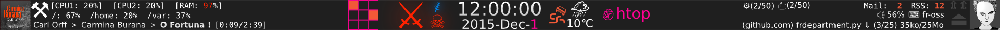
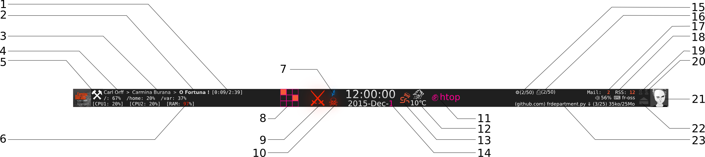
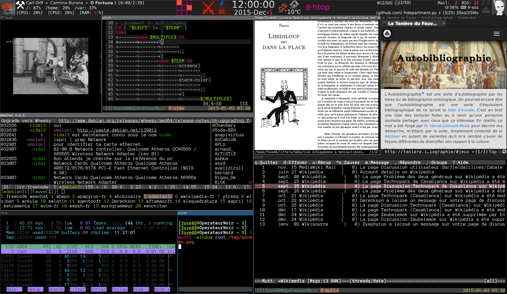

# HereticBar
A system informative bar for desktop.

The goal of this bar is to display all informations a user could need in any time. It is configurable and allow adding custom feature.

Some informations only apear when an event occure.

##Usage example

1. Time of the current played media.
2. Name of the current played song.
3. Name of the album the current played song is extract from.
4. Name of the author of the current played song.
5. According to the personnal organizer, this section inform that is time of working with the symbol ⚒ (other example, coffe time is simbolised by “☕”).
6. When a system ressource became insufficient it is hilighted.
7. Annonce an important think happening (graduation…).
8. Displaying activity on others virtual desktops.
9. Announce intrusion attempt (according to fail2ban, for example).
10. A dangerous think happend (according to rKhunter, for example).
11. Displaying when an application requires attention.
12. Weather.
13. Weather alert.
14. The day of the mont could be highlithed.
15. Update. Displaying the current number of the installed package and the total number of packages to install.
16. Printing task.
17. Biff. Displaying current unread mails.
18. Displaying current unread new RSS entry.
19. Highlighted when the Caps Lock is activated.
20. Highlighted when the Num Lock is activated.
21. The user’s avatar.
22. Highlighted when the optical reader is opened.
23. Displaying downloding task (according to a download manager like aria2).

##Screen

